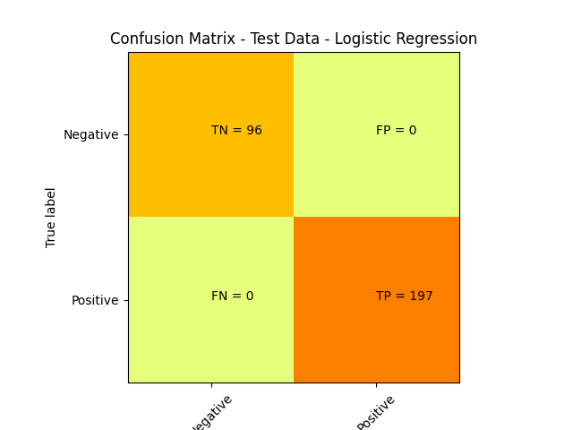
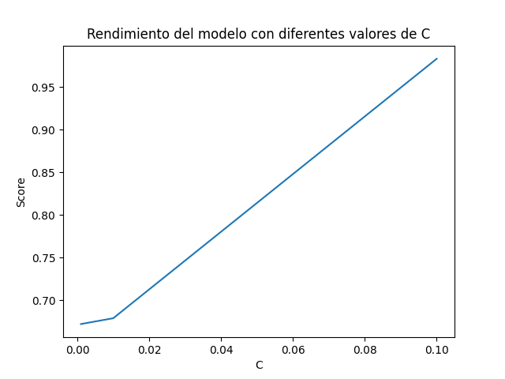

# Modelo de Aprendizaje Automático para Análisis de Datos

## Descripción

Este repositorio contiene un modelo de Aprendizaje Automático (Machine Learning) diseñado para el análisis de datos. El modelo ha sido implementado en Python y utiliza diferentes funciones así como librerías para crear un algoritmo de machine learning, en específico se creó un algoritmo de tipo clasificación utilizando regresión logística para n variables.
Lo que se quiere lograr con este modelo es predecir si un billete es falso o no, utilzando un modelo de regresion lodgistica, implementando los algoritmos linea por linea para entender el funcionamiento de este

## Dataset

El modelo utiliza el conjunto de datos "DatasetML" para entrenar y evaluar su rendimiento. El dataset consiste en datos etiquetados recopilados de https://www.kaggle.com/datasets/alexandrepetit881234/fake-bills. 
Este dataset tiene las siguientes variables como columnas:
1500 filas con 7 columnas:

is_genuine: boolean
diagonal: float
height_left: float
height_right: float
margin_low: float
margin_upper: float
length: float

Por lo que utilizaremos 6 variables independientes y una dependiente, esto con el objetivo de precdecir si un billete es falso o veradero

## Cambios Implementados

En esta sección, se describen los cambios implementados en el modelo con respecto a la versión anterior, para abordar los comentarios proporcionados por el docente:

- **Cambio Indicado**: El docente sugirió cambiar el valor de las thetas de las variables independientes
- **Acciones Tomadas**: Para abordar este comentario, se realizaron las siguientes acciones:
  1. Se cambió la función de hipótesis para que fuera utilizada en cada xi como la suma de un producto punto de (thetas, x) y thetha0 
  2. Se hizo un cambio en la aproximación a los datos, primero se limpiaron y despues se le realizó un análisis para identificar cuáles de las variables eran más importantes en el modelo
  3. Utilizando el modelo de Gradient Boosting, identifiqué que solamente las variables de Lenght, margin_up y margin_low eran significantes para el modelo, por lo que sólo utilicé esas 3
  4. Además utilicé la función de MinMaxScaler de sklearn para normalizar los datos, este se basa en la siguiente ecuación: x_normalized = (x - x_min) / (x_max - x_min). Y te permite tener tus datos en un rango de 0 a 1
  5. Se hizo un análisis de varias thetas para buscar alguna que mejore la predicción 

## ESTRUCTURA DEL CODIGO

Primero se importan las librerías necesarias para realizar el análisis

```python
import numpy as np
import pandas as pd
import matplotlib.pyplot as plt
from sklearn.ensemble import GradientBoostingClassifier
from sklearn.model_selection import train_test_split
from sklearn.metrics import confusion_matrix
from sklearn.metrics import accuracy_score
```
Después se crean las funciones matemáticas de costo y deltas de theta, estas nos ayudaran a utilizar el método del gradiente para actualizar nuestros valores de theta utilizados en una función de regresión logística, redefinir con cada iteración estos parámetros nos ayuda a acercarnos a la relevancia de cada variable independiente de nuestro problema
```python
#Función para el cambio en theta0
def dtheta0(X,y,theta0,thetak,hyp):
    return np.sum(hyp-y)/len(X)

#Función para el cambio en thetak
def dthetak(X,y,theta0,thetak,hyp):
    return np.sum((hyp-y)*X)/len(X)

#Función de hipótesis
def h(x,theta0,thetak):
    x_return = []
    for i in range(len(x)):
        dot = 0
        for j in range(len(x[i])):
            dot += x[i][j]*thetak[j]
        x_return.append(dot)
    # print(x_return[0])
    #sum int to array
    x_return = np.array(x_return)
    return np.array(1/(1+np.exp(-(theta0+x_return))))

```
En la siguiente sección se limpia y se separa el dataset con las variables necesarias para el análisis. No obstante, antes de eso se realizó un análisis con otro modelo de librería para buscar que variables eran más significantes para el modelo.

```python

# Entrenar el modelo Gradient Boosting
GB = GradientBoostingClassifier(learning_rate=0.01, n_estimators=1000)
GB.fit(X_train, y_train)
y_pred = GB.predict(X_test)

# Calcular la matriz de confusión
#Imprimimos en la terminal los resultados de GB para ver que tan relevantes son sus variables y sus resultados
cm = confusion_matrix(y_test, y_pred)
score = GB.score(X_test, y_test)
print(score, accuracy_score(y_test, y_pred), "score")
print(cm)
```

Se concluye con los resultados que la variables más significativas son 
```python
X = df[['length', 'margin_low', 'margin_up']]
```

Habiendo hecho esto separamos los datos

```python
y = df['is_genuine']
X_train, X_test, y_train, y_test = train_test_split(X, y, test_size=0.2, random_state=42)

```

Utilizamos la función MinMaxScaler para normalizar nuestros datos
```python
from sklearn.preprocessing import MinMaxScaler
# Inicializa el escalador
scaler = MinMaxScaler()

# Transformar los datos de entrenamiento y prueba
X_train_scaled = scaler.fit_transform(X_train)
X_test_scaled = scaler.transform(X_test)

#Pasar los datos de X_train_scaled y X_test_scaled a un dataframe para poder utilizarlos en la función de hipótesis
X_train_scaled = pd.DataFrame(X_train_scaled)
X_test_scaled = pd.DataFrame(X_test_scaled)
X_train_scaled.columns = ['length', 'margin_low', 'margin_up']
X_test_scaled.columns = ['length', 'margin_low', 'margin_up']

print(X_train_scaled.head())
```

Ahora que tenemos los datos normalizados, podemos implementar nuestro modelo de regresión logística y obtener una predicción

Para esta entrega se realizo una prediccion utilizando un modelo de regresion logistica pero implementando la libreria de sklearn para utilizar uno de sus modelos.
A continuacion se puede apreciar como utilizar de manera general la libreria en python

```python
from sklearn.linear_model import LogisticRegression
LogisticRegression = LogisticRegression()
LogisticRegression.fit(X_train, y_train)
y_pred = LogisticRegression.predict(X_test)
print(y_pred)
confusion_matrix_sk = confusion_matrix(y_test, y_pred)
```

# Mariz de confusion:




El resultado de sklearn fue perfecto, del 100%, muy cercano al nuestro, por lo que podemos concluir que fue bien implementado

No obstante, se realizo un analizis mas exhaustivo para utilizar algunos de los parametros que nos ofrece la libreria

Se hicieron iteraciones de 10, 50 y 100, en toda se encontro un Score y exactitud en los datos de prueba del 1.0
Sin embargo, en el score y exactitud de los datos de entrenamiento, tuvieron differentes resultados, aun que muy ceranos entre si

# 10 iteraciones
Score prueba:  1.0
Exactitud prueba:  1.0
score entrenamiento:  0.9863247863247864
Exactitud entrenamiento:  0.9863247863247864
# 50 iteraciones
Score prueba:  1.0
Exactitud prueba:  1.0
score entrenamiento:  0.9829059829059829
Exactitud entrenamiento:  0.9863247863247864
# 100 iteraciones
Score prueba:  1.0
Exactitud prueba:  1.0
score entrenamiento:  0.9829059829059829
Exactitud entrenamiento:  0.9829059829059829


- Estos datos sugieren que aun que poco, la Exactitud de la prediccion sobre los datos de prueba mejorarn al realizar mas iteraciones.
Sin embargo, es algo alarmante que sin importar que tan pocas iteraciones el modelo funcione muy bien, esto porbablemente es debido a las optimizaciones del modelo de sklearn y 
a que los datos que utilice en mi prediccion, tras haber sido limpiados y normalizados presenten una tendencia muy clara en su clasificacion binaria, lo que permite que el modelo pueda mejorar sin problema

Ademas realice una comparacion de diferentes solvers para el modelo, pero no presentaron ningun cambio (10 iteraciones)

```python
modelo10 = LogisticRegression(max_iter=10,solver='saga')
modelo10 = LogisticRegression(max_iter=10,solver='sag')
modelo10 = LogisticRegression(max_iter=10,solver='liblibear')

```

odos presentaron:

Score prueba:  1.0
Exactitud prueba:  1.0
score entrenamiento:  0.9829059829059829
Exactitud entrenamiento:  0.9829059829059829


# Ahoa se cambio el learning rate del modelo


Score prueba C=0.1:  0.9829351535836177
Exactitud prueba C=0.1:  0.9829351535836177
score entrenamiento C=0.1:  0.9555555555555556
Exactitud entrenamiento C=0.1:  0.9555555555555556


Score prueba C=0.01:  0.6791808873720137
Exactitud prueba C=0.01:  0.6791808873720137
score entrenamiento C=0.01:  0.6658119658119658
Exactitud entrenamiento C=0.01:  0.6658119658119658


Score prueba C=0.001:  0.6723549488054608
Exactitud prueba C=0.001:  0.6723549488054608
score entrenamiento C=0.001:  0.6615384615384615
Exactitud entrenamiento C=0.001:  0.6615384615384615

Por lo que podemos apreciar que aun que el modelo es muy bueno, cambiar el learning rate tan drasticamente por una potencia si puede hacer decaer bastante la exactitud del modelo en una iteracion relativamente corta como lo puede ser 10 iteraciones

# En la siguiente imagen podemos ver una grafica del rendimiento de los diferentes learning rates


