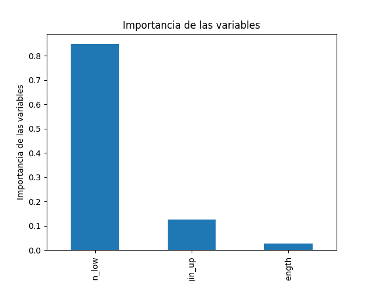
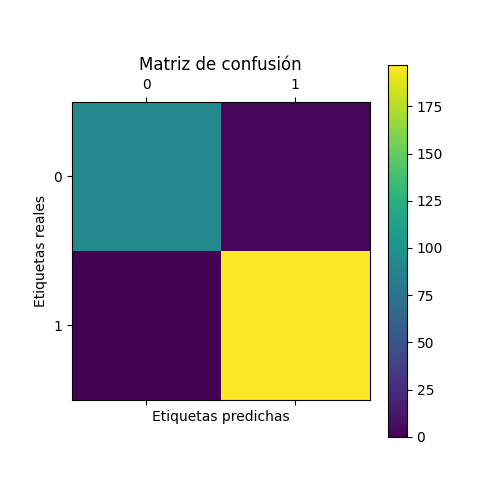

# Modelo de Aprendizaje Automático para Análisis de Datos

## Descripción

Este repositorio contiene un modelo de Aprendizaje Automático (Machine Learning) diseñado para el análisis de datos. El modelo ha sido implementado en Python y utiliza diferentes funciones así como librerías para crear un algoritmo de machine learning, en específico se creó un algoritmo de tipo clasificación utilizando regresión logística para n variables.

## Dataset

El modelo utiliza el conjunto de datos "DatasetML" para entrenar y evaluar su rendimiento. El dataset consiste en datos etiquetados recopilados de https://www.kaggle.com/datasets/alexandrepetit881234/fake-bills. 
Este dataset tiene las siguientes variables como columnas:
1500 filas con 7 columnas:

is_genuine: boolean
diagonal: float
height_left: float
height_right: float
margin_low: float
margin_upper: float
length: float

Por lo que utilizaremos 6 variables independientes y una dependiente, esto con el objetivo de precdecir si un billete es falso o veradero

## Cambios Implementados

En esta sección, se describen los cambios implementados en el modelo con respecto a la versión anterior, para abordar los comentarios proporcionados por el docente:

- **Cambio Indicado**: El docente sugirió cambiar el valor de las thetas de las variables independientes
- **Acciones Tomadas**: Para abordar este comentario, se realizaron las siguientes acciones:
  1. Se cambió la función de hipótesis para que fuera utilizada en cada xi como la suma de un producto punto de (thetas, x) y thetha0 
  2. Se hizo un cambio en la aproximación a los datos, primero se limpiaron y despues se le realizó un análisis para identificar cuáles de las variables eran más importantes en el modelo
  3. Utilizando el modelo de Gradient Boosting, identifiqué que solamente las variables de Lenght, margin_up y margin_low eran significantes para el modelo, por lo que sólo utilicé esas 3
  4. Además utilicé la función de MinMaxScaler de sklearn para normalizar los datos, este se basa en la siguiente ecuación: x_normalized = (x - x_min) / (x_max - x_min). Y te permite tener tus datos en un rango de 0 a 1
  5. Se hizo un análisis de varias thetas para buscar alguna que mejore la predicción 

## ESTRUCTURA DEL CODIGO

Primero se importan las librerías necesarias para realizar el análisis

```python
import numpy as np
import pandas as pd
import matplotlib.pyplot as plt
from sklearn.ensemble import GradientBoostingClassifier
from sklearn.model_selection import train_test_split
from sklearn.metrics import confusion_matrix
from sklearn.metrics import accuracy_score
```
Después se crean las funciones matemáticas de costo y deltas de theta, estas nos ayudaran a utilizar el método del gradiente para actualizar nuestros valores de theta utilizados en una función de regresión logística, redefinir con cada iteración estos parámetros nos ayuda a acercarnos a la relevancia de cada variable independiente de nuestro problema
```python
#Función para el cambio en theta0
def dtheta0(X,y,theta0,thetak,hyp):
    return np.sum(hyp-y)/len(X)

#Función para el cambio en thetak
def dthetak(X,y,theta0,thetak,hyp):
    return np.sum((hyp-y)*X)/len(X)

#Función de hipótesis
def h(x,theta0,thetak):
    x_return = []
    for i in range(len(x)):
        dot = 0
        for j in range(len(x[i])):
            dot += x[i][j]*thetak[j]
        x_return.append(dot)
    # print(x_return[0])
    #sum int to array
    x_return = np.array(x_return)
    return np.array(1/(1+np.exp(-(theta0+x_return))))

```
En la siguiente sección se limpia y se separa el dataset con las variables necesarias para el análisis. No obstante, antes de eso se realizó un análisis con otro modelo de librería para buscar que variables eran más significantes para el modelo.

```python

# Entrenar el modelo Gradient Boosting
GB = GradientBoostingClassifier(learning_rate=0.01, n_estimators=1000)
GB.fit(X_train, y_train)
y_pred = GB.predict(X_test)

# Calcular la matriz de confusión
#Imprimimos en la terminal los resultados de GB para ver que tan relevantes son sus variables y sus resultados
cm = confusion_matrix(y_test, y_pred)
score = GB.score(X_test, y_test)
print(score, accuracy_score(y_test, y_pred), "score")
print(cm)

A continuacion una imagen con la representacion de las variables significativas:




```

Se concluye con los resultados que la variables más significativas son 
```python
X = df[['length', 'margin_low', 'margin_up']]
```

Habiendo hecho esto separamos los datos

```python
y = df['is_genuine']
X_train, X_test, y_train, y_test = train_test_split(X, y, test_size=0.2, random_state=42)

```

Utilizamos la función MinMaxScaler para normalizar nuestros datos
```python
from sklearn.preprocessing import MinMaxScaler
# Inicializa el escalador
scaler = MinMaxScaler()

# Transformar los datos de entrenamiento y prueba
X_train_scaled = scaler.fit_transform(X_train)
X_test_scaled = scaler.transform(X_test)

#Pasar los datos de X_train_scaled y X_test_scaled a un dataframe para poder utilizarlos en la función de hipótesis
X_train_scaled = pd.DataFrame(X_train_scaled)
X_test_scaled = pd.DataFrame(X_test_scaled)
X_train_scaled.columns = ['length', 'margin_low', 'margin_up']
X_test_scaled.columns = ['length', 'margin_low', 'margin_up']

print(X_train_scaled.head())
```

Ahora que tenemos los datos normalizados, podemos implementar nuestro modelo de regresión logística y obtener una predicción

```python
#Inicializar los thetas y deltas de manera aleatoria para las variables
theta0 = 0.1
thetak = [0.2,0.3,0.4]
delta0 = 0
deltak = [0,0,0]
alpha = 0.01
iterations = 10000
n = len(X_train)

X_train = np.array(X_train_scaled)
y_train = np.array(y_train)
X_test = np.array(X_test_scaled)
y_test = np.array(y_test)

#Realizamos el descenso de gradiente para encontrar los thetas
for i in range(iterations):
    #Se crea la hipótesis
    hyp = h(X_train,theta0,thetak)
    #se actualiza el cambio en theta0 y thetak
    delta0 = dtheta0(X_train,y_train,theta0,thetak,hyp)
    for j in range(len(thetak)):
        deltak[j] = dthetak(X_train[:,j],y_train,theta0,thetak[j],hyp)
    #se actualizan los theta0 y thetak
    theta0 = theta0 - alpha*delta0
    for j in range(len(thetak)):
        thetak[j] = thetak[j] - alpha*deltak[j]

```

Y ahora realizamos el análisis y predicciones

```python

#predicciones con mi hipótesis
hyp = h(X_test,theta0,thetak)
predicted_labels = (hyp >= 0.5).astype(int)

print("Theta0: ",theta0)
print("Thetak: ",thetak)
print("Hyp: ",hyp)
print("Predicted labels: ",predicted_labels)
print("Real labels: ",y_test)


print(hyp)

for i in range(len(hyp)):
    if hyp[i] >= 0.5:
        hyp[i] = 1
    else:
        hyp[i] = 0


# Se corren algunas predicciones para validar la salida del modelo, usando datos diferentes a los de entrenamiento

Falso_positivo = 0
Falso_negativo = 0
Verdadero_positivo = 0
Verdadero_negativo = 0
for i in range(len(hyp)):
    if hyp[i] == 1 and y_test[i] == 1:
        Verdadero_positivo += 1
    elif hyp[i] == 1 and y_test[i] == 0:
        Falso_positivo += 1
    elif hyp[i] == 0 and y_test[i] == 1:
        Falso_negativo += 1
    elif hyp[i] == 0 and y_test[i] == 0:
        Verdadero_negativo += 1

print("Falso positivo: ",Falso_positivo)
print("Falso negativo: ",Falso_negativo)
print("Verdadero positivo: ",Verdadero_positivo)
print("Verdadero negativo: ",Verdadero_negativo)

#Exactitud
print("Exactitud: ",(Verdadero_positivo+Verdadero_negativo)/(Verdadero_positivo+Verdadero_negativo+Falso_positivo+Falso_negativo))
#Precisión
print("Precisión: ",(Verdadero_positivo)/(Verdadero_positivo+Falso_positivo))
#Exhaustividad
print("Exhaustividad: ",(Verdadero_positivo)/(Verdadero_positivo+Falso_negativo))
#F1
print("F1: ",(2*Verdadero_positivo)/(2*Verdadero_positivo+Falso_positivo+Falso_negativo))

#Se corren algunas predicciones para validar la salida del modelo, usando datos diferentes a los de entrenamiento


```

Tras las mejoras realizadas después de la revisión pasada, mi modelo pasó de tener una exactitud y presición de 0% y 0% a:

# Falso positivo:  3
# Falso negativo:  0
# Verdadero positivo:  197
# Verdadero negativo:  93
# Exactitud:  0.9897610921501706
# Precisión:  0.985
# Exhaustividad:  1.0
# F1:  0.9924433249370277

Para complementar el análisis, se hizo el mismo entrenamiento pero con el modelo de sklearn,
```python
from sklearn.linear_model import LogisticRegression
LogisticRegression = LogisticRegression()
LogisticRegression.fit(X_train, y_train)
y_pred = LogisticRegression.predict(X_test)
print(y_pred)
confusion_matrix_sk = confusion_matrix(y_test, y_pred)
```

El resultado de sklearn fue perfecto, del 100%, muy cercano al nuestro, por lo que podemos concluir que fue bien implementado
A continuacion una imagen en representacion de la matriz de confusion



# Probar datos de entrenamiento

Para comprobar la presicion de nuestro modelo, tambien se probaron los datos de entrenamiento, con los siguientnes resultados:
Falso positivo:  3
Falso negativo:  0
Verdadero positivo:  197
Verdadero negativo:  93
Exactitud:  0.9897610921501706
Precisión:  0.985
Exhaustividad:  1.0
F1:  0.9924433249370277
Falso positivo:  45
Falso negativo:  1
Verdadero positivo:  970
Verdadero negativo:  447
Exactitud:  0.9685577580314423
Precisión:  0.9556650246305419
Exhaustividad:  0.9989701338825953
F1:  0.9768378650553877

Por lo que podemos apreciar que existe un sesgo grande hacia los positivos en nuestro modelo.


